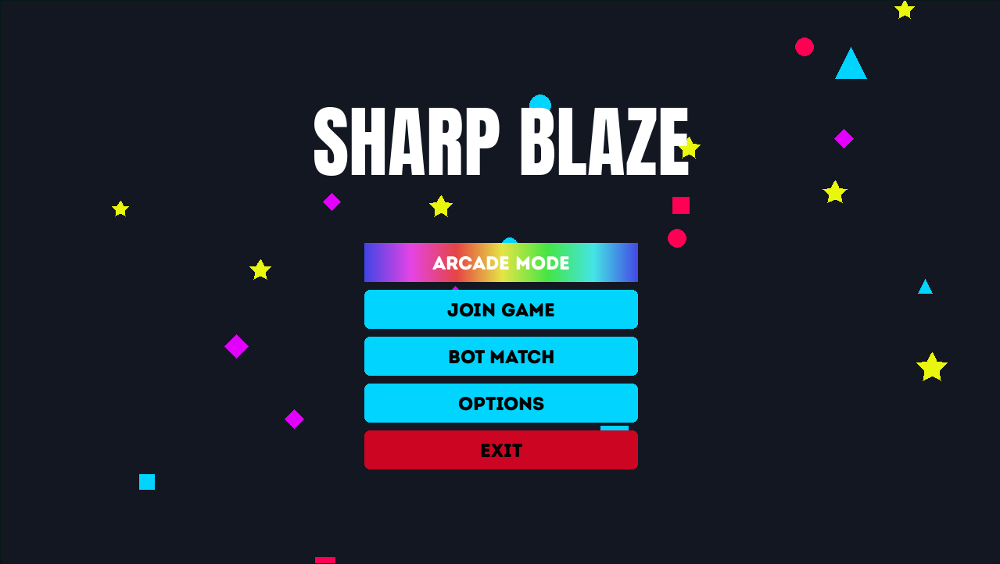
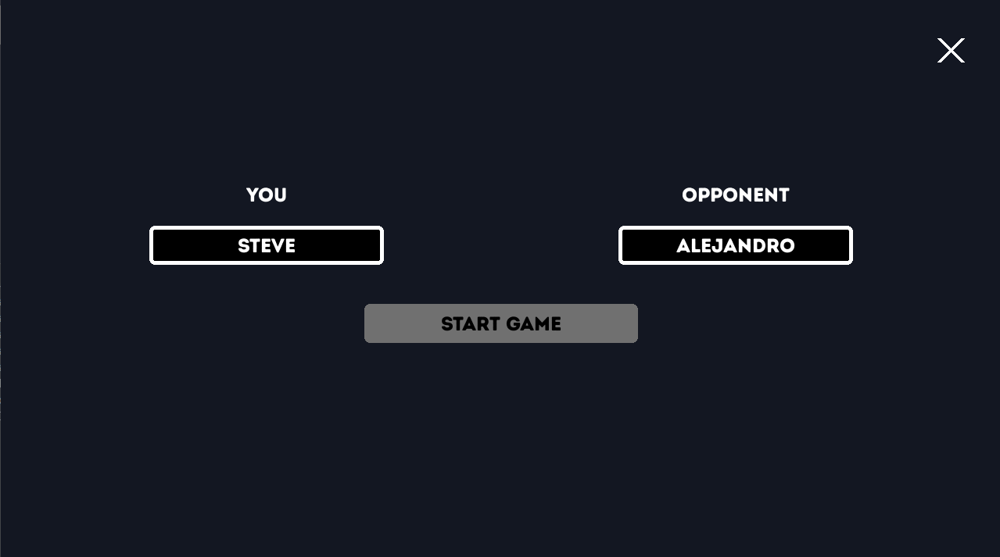
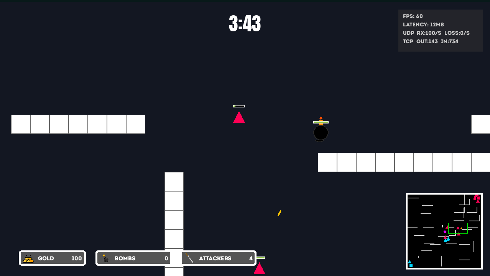
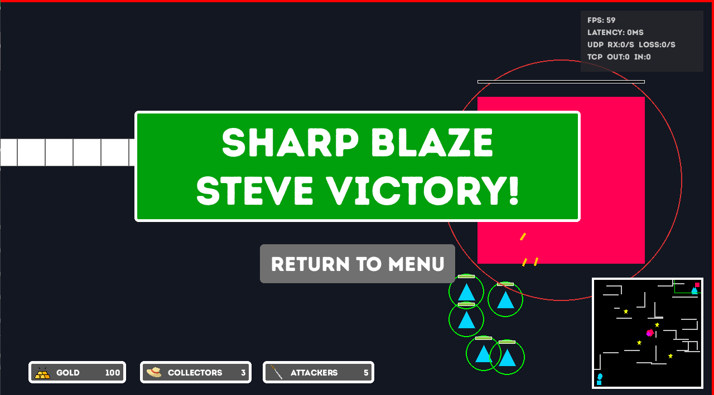
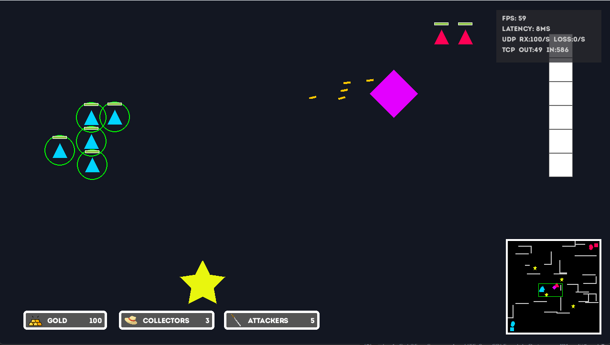
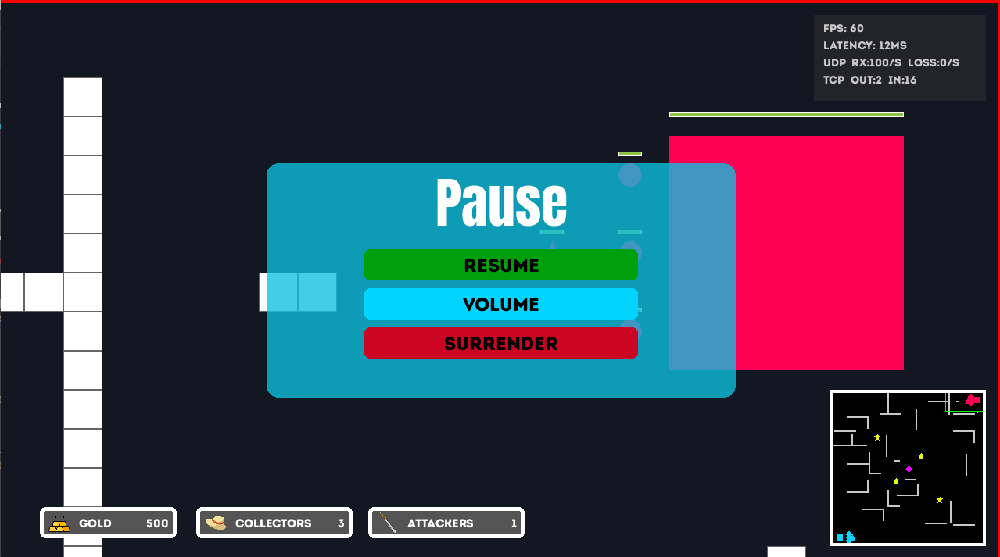

# Sharp Blaze

A real-time strategy game where two players battle for base supremacy.



## What is Sharp Blaze?

Sharp Blaze is a multiplayer RTS built as an academic integration project. Two players queue through a matchmaking broker, get paired into a dedicated game server, and compete to destroy each other's base. The authoritative game logic runs in C++, the client uses Python with Pygame, and the whole system can be containerized with Docker.



## Academic Integration

| Subject | Implementation |
|---|---|
| **Distributed Systems** | Authoritative Client-Server over POSIX sockets (TCP + UDP) in C++. Session management with multi-threading and spatial grid synchronization. |
| **Artificial Intelligence** | A* pathfinder (`PathFinder.cpp`) integrated server-side for unit navigation. Client-side AI module scaffolded under `src/client/ia/`. |
| **Optimization Methods** | Simplex-based strategic decision engine scaffolded under `src/client/optimization/`. |
| **Service Administration** | Full containerization with Docker and Docker Compose. The broker manages dynamic container lifecycle via the Docker SDK. |
| **Software Engineering** | Agile/Scrum workflow with Git, formal technical documentation in `docs/`, and modular screen/component architecture in the client. |

## How to Play

### Game Flow

1. **Main Menu** — Launch the client and choose your mode.
2. **Lobby** — Enter the matchmaking queue. Wait for a second player to join.
3. **Connecting** — The broker pairs you and spawns a game server.
4. **Game** — Build units, gather resources, and attack.



### Controls

| Input | Action |
|---|---|
| Left-click | Select a unit or structure |
| Drag | Box-select multiple units |
| Right-click (ground) | Move selected units |
| Right-click (enemy) | Attack target |
| WASD | Pan the camera |
| ESC | Pause / open menu |
| Minimap click | Jump camera to location |

### Game Modes

**Normal** — Full multiplayer experience. Collectors gather gold from mines, shops let you buy units, and the matchmaking broker pairs two players. For solo testing, enable `OFFLINE_DEBUG_MODE` in `src/client/utils/config.py` to skip the broker and load a local game with pre-placed units.

**Arcade** — A fast 5-minute timed match. Bombs replace collectors, kills grant gold, and a 6-step tutorial guides new players through popups. Fully functional.

**Bot Match** — Play against AI at three difficulty levels. Requires Docker so the broker can spawn a server container with bot support.

### Units & Structures

| Name | Cost | Role |
|---|---|---|
| Attacker | 200g | Combat unit, shoots projectiles |
| Collector | 100g | Gathers gold from resource mines |
| Bomb | 1000g | Arcade-only, high damage |
| Base | Free | Your headquarters. If it falls, you lose. |
| Shop | Free | Buy units and collectors |
| Resource Mine | Neutral | Gold source for collectors |

### How to Win

1. Destroy the enemy base.
2. Outlast the opponent in Arcade mode (highest score when the timer expires).
3. Force a surrender.





## Installation & Setup

### Prerequisites

- Python 3.12 or newer
- CMake 3.20 or newer
- C++17 compiler (GCC, Clang, or MSYS2 UCRT64 on Windows)
- Docker (optional, for containerized setup)

### Quick Start with Docker

```bash
# 1. Clone the repository
git clone https://github.com/Felkim-dev/Sharp-Blaze.git
cd Sharp-Blaze

# 2. Create a .env file with your server IP
echo SERVER_IP=127.0.0.1 > .env

# 3. Build and start the broker + game server image
docker-compose up --build

# 4. In a second terminal, install client dependencies and launch
cd src/client
pip install -r requirements.txt
python main.py
```

You need **two client instances** to trigger matchmaking. Open a third terminal and run the same `python main.py` command again. Both clients will enter the queue and get paired.



### Local Setup (Without Docker)

**Step 1: Create the `.env` file**

Create a file named `.env` in the project root:

```
SERVER_IP=127.0.0.1
BROKER_PORT=6000
GAME_TCP_PORT=5555
GAME_UDP_PORT=5556
```

**Step 2: Build the game server**

On Linux:
```bash
cd src/server
cmake -S Makefile -B build/linux -DCMAKE_BUILD_TYPE=Release
cmake --build build/linux -j
./build/linux/sharp_blaze_server
```

On Windows (MSYS2 UCRT64 shell):
```bash
cd src/server
cmake -S Makefile -B build/win -DCMAKE_BUILD_TYPE=Release -G "MSYS Makefiles"
cmake --build build/win -j
./build/win/sharp_blaze_server.exe
```

**Step 3: Start the broker in stub mode**

The broker package needs an `__init__.py` file to be importable. Create it first:

```bash
touch src/broker/__init__.py
```

Then start the broker with stub matchmaking (skips Docker, returns local endpoints):

```bash
cd src/broker
pip install -r requirements.txt
BROKER_ALLOW_STUB=1 python -m broker.app
```

On PowerShell:
```powershell
cd src/broker
pip install -r requirements.txt
$env:BROKER_ALLOW_STUB="1"; python -m broker.app
```

**Step 4: Launch the client**

```bash
cd src/client
pip install -r requirements.txt
python main.py
```

Open a second terminal and run the same command to get a second player for matchmaking.

### Offline Debug Mode

For solo testing without networking, set `OFFLINE_DEBUG_MODE = True` in `src/client/utils/config.py`. This skips the broker and loads a local game with pre-placed units so you can test the UI and controls alone.

## Running the Server

### Environment Variables

**Broker:**

| Variable | Default | Description |
|---|---|---|
| `SERVER_IP` | `127.0.0.1` | Host IP for spawned game servers |
| `BROKER_PORT` | `6000` | Broker listening port |
| `GAME_TCP_PORT` | `5555` | Game server TCP port |
| `GAME_UDP_PORT` | `5556` | Game server UDP port |
| `BROKER_ALLOW_STUB` | `0` | Set to `1` to skip Docker and use stub endpoints |

**Game Server:**

| Variable | Default | Description |
|---|---|---|
| `SHARP_BLAZE_TCP_PORT` | `5555` | TCP listening port |
| `SHARP_BLAZE_UDP_PORT` | `5556` | UDP broadcast port |
| `SHARP_BLAZE_SESSION_ID` | `0` | Session identifier |
| `SHARP_BLAZE_GAME_MODE` | `normal` | Game mode (`normal` or `arcade`) |

### Startup Options

| Method | Broker | Game Server | Best For |
|---|---|---|---|
| Docker | Full matchmaking | Auto-spawned per match | Production, LAN parties |
| Manual + Stub | Stub mode (local endpoints) | Run by hand | Development, debugging |
| Manual + Docker | Full matchmaking | Auto-spawned | Testing without full Docker compose |

## Troubleshooting

**"ModuleNotFoundError: No module named 'broker'"**

The broker package is missing `__init__.py`. Create it: `touch src/broker/__init__.py`. Then restart with `python -m broker.app`.

**"Port 6000 already in use"**

Another process is using the broker port. Change `BROKER_PORT` in your `.env` file, or stop the existing process with `netstat -ano | findstr :6000` (Windows) or `lsof -i :6000` (Linux).

**"Stuck in matchmaking queue"**

You need a second client instance to trigger a match. Open another terminal and run `python main.py` again. Both clients must be in the queue at the same time.

**Docker daemon not running**

Start Docker Desktop on Windows or run `sudo systemctl start docker` on Linux. Verify with `docker ps`.

**CMake not found**

Install CMake 3.20 or newer. On Ubuntu: `sudo apt install cmake`. On Windows with MSYS2: `pacman -S mingw-w64-ucrt-x86_64-cmake`.

## Tech Stack

| Layer | Technology |
|---|---|
| Game Server | C++17, CMake, POSIX Sockets |
| Broker | Python 3.12, asyncio, Docker SDK |
| Client | Python 3.12, Pygame-CE 2.5.7 |
| Infrastructure | Docker, Docker Compose |
| Networking | TCP (game logic) + UDP (position updates) |

## Development Roadmap

| Sprint | Focus |
|---|---|
| S1–S2 | Infrastructure: initial handshake, broker, Docker setup |
| S3–S4 | World & Movement: shared grid, TCP/UDP sync, camera |
| S5–S6 | Game Logic: resource system, combat, health management |
| S7–S8 | Tactical AI: A* pathfinding server-side integration |
| S9–S10 | Strategic Optimization: Simplex model for bot decisions |
| S11–S12 | QA & Polish: load testing, bug fixes, final documentation |

## Contributors

- **Steve Tene** — Lead Developer A · Backend, Networking & Infrastructure
- **Felipe Quilumbango** — Lead Developer B · Frontend
- **Kevin Sánchez** — Lead Developer C · AI Implementation
