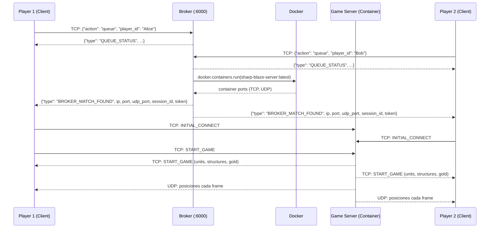
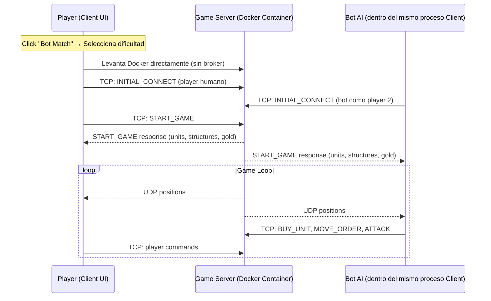
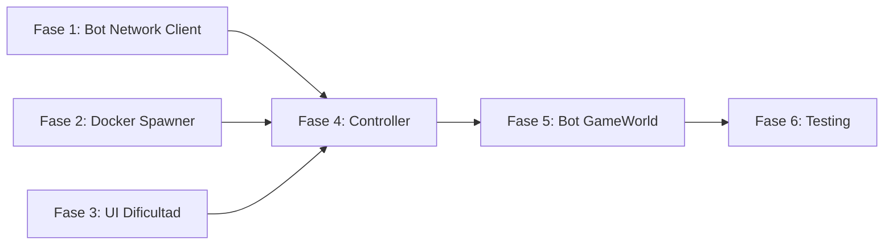

# 🤖 Plan de Integración: Bot AI → Sharp-Blaze

## Resumen Ejecutivo

Después de analizar **todo** el codebase, aquí van las respuestas a tus preguntas directas y el plan completo fase por fase.

---

## 📋 Respuestas a tus Preguntas

### 1. ¿Tu IA cubre el apartado de recibir mensajes UDP?

> [!WARNING]
> **No, tu lógica en `src/client/ia/` NO cubre UDP.** Tu bot solo genera comandos TCP (via `network.send_json()`).

**Explicación:** El sistema actual funciona así:
- **TCP (enviar)**: El bot envía comandos (`BUY_UNIT`, `MOVE_ORDER`, `ATTACK`) → estos ya los cubres correctamente en [bot_ai.py](file:///c:/Users/Usuario/Documents/YachayTech/Seventh_semester/IA/final_project/Sharp-Blaze/src/client/ia/bot_ai.py#L119-L186)
- **UDP (recibir)**: El servidor envía las **posiciones actualizadas** de todas las unidades en paquetes de 12 bytes (`<iff` → entity_id, grid_x, grid_y). Esto lo maneja [network.py _udp_listen_loop](file:///c:/Users/Usuario/Documents/YachayTech/Seventh_semester/IA/final_project/Sharp-Blaze/src/client/network/network.py#L121-L146)
- **Tu bot necesita recibir UDP** para que `GameWorld` se actualice con las posiciones reales de las unidades (enemigo y propias), porque `GameStateAnalyzer` lee `game_world.units[unit_id].x, .y` para calcular threat, positions, etc.

**Pero tranquilo:** No necesitas implementar UDP en tu lógica de IA. La clase `NetworkManager` ya existente maneja UDP automáticamente. Tu bot usará la **misma instancia** de `NetworkManager` que ya existe, y el `GameWorld` se actualizará solo via `world.update()` → `network.get_latest_positions()`.

### 2. ¿Dónde se implementa el Broker?

El broker está implementado en estos archivos:

| Archivo | Rol |
|---------|-----|
| [brokerServer.py](file:///c:/Users/Usuario/Documents/YachayTech/Seventh_semester/IA/final_project/Sharp-Blaze/src/broker/brokerServer.py) | **Servidor principal** del broker. Maneja cola de espera, empareja 2 jugadores, y notifica con `BROKER_MATCH_FOUND` |
| [dockerMatchSpawner.py](file:///c:/Users/Usuario/Documents/YachayTech/Seventh_semester/IA/final_project/Sharp-Blaze/src/broker/dockerMatchSpawner.py) | **Levanta contenedores Docker** del servidor C++ para cada match. Usa `docker.from_env()` y la imagen `sharp-blaze-server:latest` |
| [stubMatchSpawner.py](file:///c:/Users/Usuario/Documents/YachayTech/Seventh_semester/IA/final_project/Sharp-Blaze/src/broker/stubMatchSpawner.py) | Stub para desarrollo local — no levanta Docker, devuelve IP/puerto fijos |
| [matchSpawner.py](file:///c:/Users/Usuario/Documents/YachayTech/Seventh_semester/IA/final_project/Sharp-Blaze/src/broker/matchSpawner.py) | Interfaz base: `MatchParticipant`, `MatchEndpoint`, `MatchSpawner` |
| [app.py](file:///c:/Users/Usuario/Documents/YachayTech/Seventh_semester/IA/final_project/Sharp-Blaze/src/broker/app.py) | Entrypoint que elige Docker o Stub spawner y escucha en puerto 6000 |
| [docker-compose.yml](file:///c:/Users/Usuario/Documents/YachayTech/Seventh_semester/IA/final_project/Sharp-Blaze/docker-compose.yml) | Orquesta broker + server image. El broker tiene acceso al Docker socket para crear contenedores |

**Flujo actual (PvP):**


---

## 🏗️ Arquitectura Propuesta: Modo Bot Match

Tu equipo quiere que el **broker se ignore** en modo bot. El flujo propuesto es:



> [!IMPORTANT]
> **Decisión clave**: El bot se ejecuta como un "segundo cliente" **dentro del mismo proceso** del jugador humano. No necesita un proceso separado. Esto simplifica enormemente el deployment y elimina problemas de sincronización.

---

## 📐 Plan Fase por Fase

---

### FASE 1: Bot como Segundo Cliente (Networking) 🔌
**Objetivo:** Hacer que el bot pueda conectarse al mismo Game Server que el jugador humano via TCP y recibir UDP.

**Archivos a crear/modificar:**

#### 1.1 Crear `src/client/ia/bot_network_client.py`
Un wrapper ligero alrededor de `NetworkManager` para el bot. El bot necesita su **propia** instancia de NetworkManager porque:
- Necesita su propio socket TCP (diferente player_id)
- Necesita su propio socket UDP (diferente puerto)
- El `NetworkManager` existente del humano ya tiene un `client_tcp` ocupado

```python
# src/client/ia/bot_network_client.py
"""
Headless network client for the bot.
Same TCP/UDP protocol as the human player, but no Pygame dependency.
"""
import socket
import json
import struct
import threading
import time

class BotNetworkClient:
    """
    Lightweight network client for the bot AI.
    Connects to the Game Server as Player 2.
    
    - TCP: sends commands (BUY_UNIT, MOVE_ORDER, ATTACK)
    - UDP: receives unit positions from server
    """
    def __init__(self):
        self.client_tcp = None
        self.connected = False
        self.connection_status = "IDLE"
        self.receive_buffer = ""
        self.pending_messages = []
        
        # UDP
        self.client_udp = socket.socket(socket.AF_INET, socket.SOCK_DGRAM)
        self.client_udp.bind(("0.0.0.0", 0))  # OS assigns free port
        self.udp_port_server = None
        self.server_ip = None
        self.latest_positions = {}
        self.is_udp_listening = False
        self.udp_endpoint_registered = False
        self.cell_size = 50
        
    def connect_tcp(self, ip: str, port: int, player_id: str, 
                    session_id: int, token: str) -> bool:
        """Connect to game server via TCP as bot player"""
        # ... TCP connect + INITIAL_CONNECT message
        
    def init_udp(self, session_id: int, player_id: int):
        """Initialize UDP reception for game state updates"""
        # ... Same protocol as NetworkManager.init_udp_connection()
        
    def send_json(self, data: dict):
        """Send TCP command to server"""
        # ... Same as NetworkManager.send_json()
        
    def receive_json(self) -> dict:
        """Receive TCP response from server"""
        # ... Same as NetworkManager.receive_json()
        
    def get_latest_positions(self) -> dict:
        """Get UDP position updates"""
        # ... Same as NetworkManager.get_latest_positions()
```

#### 1.2 Qué NO necesitas hacer
- **No tocar el broker** — el modo bot lo bypasea completamente
- **No crear un proceso separado** — el bot corre en un thread dentro del mismo proceso del cliente
- **No modificar el servidor C++** — ya soporta 2 clientes TCP

**Verificación Fase 1:**
- [ ] `BotNetworkClient` puede conectarse TCP a un game server en Docker
- [ ] Puede enviar `INITIAL_CONNECT` y recibir respuesta
- [ ] Puede recibir paquetes UDP de posiciones
- [ ] Test: ejecutar el server en Docker, conectar humano + bot, verificar que ambos reciben `START_GAME`

---

### FASE 2: Docker Spawner Directo (Sin Broker) 🐳
**Objetivo:** Cuando el jugador selecciona "Bot Match", levantar un contenedor Docker directamente sin pasar por el broker.

**Archivos a crear/modificar:**

#### 2.1 Crear `src/client/ia/bot_match_spawner.py`
```python
# src/client/ia/bot_match_spawner.py
"""
Spawns a Docker game server directly for Bot Match mode.
Bypasses the broker entirely.
"""
import docker
import secrets
import time

class BotMatchSpawner:
    """
    Directly spawns a game server Docker container.
    Used for Player vs Bot mode (no broker matchmaking needed).
    """
    def __init__(self):
        self.client = docker.from_env()
        self.image = "sharp-blaze-server:latest"
        self.container = None
        
    def spawn(self) -> dict:
        """
        Spawn a game server container and return connection info.
        
        Returns:
            dict with keys: ip, tcp_port, udp_port, session_id, token
        """
        session_id = 9000  # Bot sessions use high IDs
        token = secrets.token_hex(16)
        
        environment = {
            "SHARP_BLAZE_SESSION_ID": str(session_id),
            "SHARP_BLAZE_SESSION_TOKEN": token,
            "SHARP_BLAZE_PLAYER_ONE": "human_player",
            "SHARP_BLAZE_PLAYER_TWO": "bot_ai",
            "SHARP_BLAZE_TCP_PORT": "5555",
            "SHARP_BLAZE_UDP_PORT": "5556",
        }
        
        self.container = self.client.containers.run(
            image=self.image,
            detach=True,
            environment=environment,
            ports={"5555/tcp": None, "5556/udp": None},
            name=f"sharp-blaze-bot-{session_id}",
            remove=True,
        )
        
        self.container.reload()
        port_map = self.container.attrs["NetworkSettings"]["Ports"]
        tcp_binding = port_map.get("5555/tcp")
        udp_binding = port_map.get("5556/udp")
        
        return {
            "ip": "127.0.0.1",
            "tcp_port": int(tcp_binding[0]["HostPort"]),
            "udp_port": int(udp_binding[0]["HostPort"]),
            "session_id": session_id,
            "token": token,
        }
        
    def cleanup(self):
        """Stop and remove the container"""
        if self.container:
            try:
                self.container.stop()
            except Exception:
                pass
```

**Verificación Fase 2:**
- [ ] `BotMatchSpawner.spawn()` levanta un contenedor Docker correctamente
- [ ] Retorna puertos mapeados accesibles
- [ ] `cleanup()` detiene el contenedor al terminar
- [ ] Test manual: spawn → connect TCP → verificar respuesta

---

### FASE 3: UI – Pantalla de Selección de Dificultad 🎮
**Objetivo:** Agregar una pantalla en el menú principal para seleccionar la dificultad del bot.

**Archivos a modificar:**

#### 3.1 Crear `src/client/ui/bot_difficulty_screen.py`
Nueva pantalla con 3 botones de dificultad + botón Back:

```
┌──────────────────────────────────┐
│                                  │
│         BOT MATCH                │
│                                  │
│      [ EASY ]                    │
│      [ MEDIUM ]                  │
│      [ HARD ]                    │
│                                  │
│      [ BACK ]                    │
│                                  │
└──────────────────────────────────┘
```

Al hacer click en una dificultad:
1. Guarda la dificultad seleccionada
2. Inicia el flujo de Bot Match (spawn Docker → connect → play)
3. Transiciona a una pantalla de "Connecting..." y luego a `GameScreen`

#### 3.2 Modificar `src/client/main.py`
Registrar la nueva pantalla en el dict de screens:

```python
from ui.bot_difficulty_screen import BotDifficultyScreen

# En _build_screens():
self.screens = {
    "MAIN": MainScreen(self, self.screen),
    "JOIN": JoinScreen(self, self.screen),
    "BOT_DIFFICULTY": BotDifficultyScreen(self, self.screen),  # NUEVO
    "LOBBY": LobbyScreen(self, self.screen),
    "CONNECTING": ConnectingScreen(self, self.screen),
    "GAME": GameScreen(self, self.screen),
}
```

#### 3.3 Modificar `src/client/ui/main_screen.py`
Conectar el botón "Bot Match" existente (línea 307-309):

```python
# Cambiar de:
elif self.btn_bot.button_rectangle.collidepoint(mouse_pos):
    AudioManager().play_click()
    print("Iniciando partida BOT MATCH...")

# A:
elif self.btn_bot.button_rectangle.collidepoint(mouse_pos):
    AudioManager().play_click()
    self.screen_manager.change_screen("BOT_DIFFICULTY")
```

**Verificación Fase 3:**
- [ ] Botón "Bot Match" en menú principal abre la pantalla de dificultad
- [ ] Los 3 botones de dificultad están visibles y funcionales
- [ ] Botón "Back" regresa al menú principal
- [ ] Hover effects funcionan correctamente

---

### FASE 4: Orquestador del Modo Bot Match 🎯
**Objetivo:** Coordinar todo el flujo cuando el jugador selecciona una dificultad: spawn Docker → connect ambos → iniciar partida.

**Archivos a crear:**

#### 4.1 Crear `src/client/ia/bot_match_controller.py`
```python
# src/client/ia/bot_match_controller.py
"""
Orchestrates a Player vs Bot match:
1. Spawns Docker game server
2. Connects human player (existing NetworkManager)
3. Connects bot player (BotNetworkClient)
4. Starts the game
5. Runs bot AI loop in background thread
"""
import threading
import time

class BotMatchController:
    def __init__(self, difficulty: str, human_network, game_screen):
        self.difficulty = difficulty
        self.human_network = human_network
        self.game_screen = game_screen
        self.spawner = None
        self.bot_network = None
        self.bot_ai = None
        self.bot_thread = None
        self.is_running = False
        
    def start_match(self):
        """
        Full sequence:
        1. Spawn Docker server
        2. Connect human player (TCP)
        3. Connect bot player (TCP) 
        4. Send START_GAME
        5. Init UDP for both
        6. Start bot AI loop
        """
        # Step 1: Spawn server
        self.spawner = BotMatchSpawner()
        server_info = self.spawner.spawn()
        time.sleep(1)  # Wait for server to initialize
        
        # Step 2: Connect human
        match_payload = {
            "ip": server_info["ip"],
            "port": server_info["tcp_port"],
            "udp_port": server_info["udp_port"],
            "session_id": server_info["session_id"],
            "token": server_info["token"],
            "you": "human_player",
            "global_player_id": 1,
        }
        self.human_network.connect_to_game_server(match_payload)
        
        # Step 3: Connect bot
        self.bot_network = BotNetworkClient()
        self.bot_network.connect_tcp(
            server_info["ip"],
            server_info["tcp_port"],
            "bot_ai",
            server_info["session_id"],
            server_info["token"]
        )
        
        # Step 4-6: Send START_GAME, init UDP, start bot loop
        # (Will be triggered after both clients are connected)
        
    def _bot_loop(self):
        """Background thread: runs bot AI decisions"""
        while self.is_running:
            # Receive game state updates via TCP
            data = self.bot_network.receive_json()
            if data:
                self._process_server_message(data)
            
            # Run bot AI decision cycle
            if self.bot_ai:
                self.bot_ai.update(self.bot_game_world, self.bot_game_state)
            
            time.sleep(0.016)  # ~60 FPS
            
    def stop(self):
        """Clean shutdown"""
        self.is_running = False
        if self.bot_network:
            self.bot_network.disconnect()
        if self.spawner:
            self.spawner.cleanup()
```

**Verificación Fase 4:**
- [ ] El controlador ejecuta la secuencia completa: spawn → connect × 2 → start_game
- [ ] El bot se conecta como Player 2 y recibe START_GAME
- [ ] El humano se conecta como Player 1 y recibe START_GAME
- [ ] Test: juego inicia correctamente con ambos jugadores conectados

---

### FASE 5: Integrar Bot AI con GameWorld del Bot 🧠
**Objetivo:** El bot necesita su propia instancia de `GameWorld` (sin rendering) para rastrear el estado del juego.

#### 5.1 Crear `src/client/ia/bot_game_world.py`
Un `GameWorld` ligero que solo trackea unidades y posiciones, sin Pygame drawing:

```python
# Solo necesita:
# - units dict (id -> unit_data)
# - structures dict
# - get_owner_from_id()
# - Actualizarse con paquetes UDP del servidor
# NO necesita: draw(), sprites, camera, projectiles, etc.
```

#### 5.2 Crear `src/client/ia/bot_game_screen.py`
Un "GameScreen" virtual que mantiene el `player_gold` y procesa mensajes TCP sin UI:

```python
# Procesa los mismos tipos de mensaje que GameScreen.update():
# - START_GAME → build_initial_state()
# - BUY_UNIT_RESULT → spawn_unit, update gold
# - UNIT_SPAWNED → add enemy unit
# - RESOURCES → update gold
# - UNIT_DAMAGED → update HP
# - ENTITY_DESTROYED → remove unit
# - GAME_OVER → stop bot
```

#### 5.3 Conectar con tu lógica existente
Tu `BotAI.update()` ya espera `game_world` y `game_screen`:

```python
# bot_ai.py línea 64:
def update(self, game_world, game_screen) -> bool:
    current_gold = game_screen.player_gold  # ← BotGameScreen provee esto
    game_state = self.analyzer.analyze(game_world, current_gold)  # ← BotGameWorld provee esto
```

**Verificación Fase 5:**
- [ ] `BotGameWorld` se actualiza correctamente con paquetes UDP
- [ ] `BotGameScreen` procesa mensajes TCP y mantiene gold actualizado
- [ ] `BotAI.update()` genera comandos válidos usando el game world real
- [ ] Test: iniciar match, verificar que el bot compra unidades y las mueve

---

### FASE 6: Testing Integrado 🧪
**Objetivo:** Validar todo el flujo end-to-end.

#### 6.1 Test Manual
```
1. Construir imagen Docker del servidor: docker-compose build game-server-image
2. Ejecutar el cliente: python src/client/main.py
3. Click "Bot Match" → "EASY"
4. Verificar que Docker levanta un contenedor
5. Verificar que el juego inicia con unidades de ambos jugadores
6. Observar que el bot compra unidades, las mueve, y ataca
7. Verificar que el juego termina correctamente (GAME_OVER)
```

#### 6.2 Verificaciones por dificultad
| Dificultad | Decision Cycle | Agresividad | Comportamiento esperado |
|------------|---------------|-------------|------------------------|
| EASY | 1500ms | 0.3 | Compra más collectors, ataca poco |
| MEDIUM | 800ms | 0.6 | Equilibrado entre collect/attack |
| HARD | 300ms | 0.9 | Compra attackers rápido, asedio temprano |

---

## 📁 Resumen de Archivos

### Archivos a CREAR:
| Archivo | Fase | Descripción |
|---------|------|-------------|
| `src/client/ia/bot_network_client.py` | 1 | Cliente TCP/UDP headless para el bot |
| `src/client/ia/bot_match_spawner.py` | 2 | Levanta Docker game server directamente |
| `src/client/ui/bot_difficulty_screen.py` | 3 | Pantalla UI para seleccionar dificultad |
| `src/client/ia/bot_match_controller.py` | 4 | Orquestador del flujo completo |
| `src/client/ia/bot_game_world.py` | 5 | GameWorld ligero sin rendering |
| `src/client/ia/bot_game_screen.py` | 5 | GameScreen virtual sin UI |

### Archivos a MODIFICAR:
| Archivo | Fase | Cambio |
|---------|------|--------|
| `src/client/main.py` | 3 | Registrar `BOT_DIFFICULTY` screen |
| `src/client/ui/main_screen.py` | 3 | Conectar botón "Bot Match" → nueva pantalla |

### Archivos que NO se tocan:
- ❌ `src/broker/*` — el modo bot bypasea el broker
- ❌ `src/server/*` — el servidor C++ ya soporta 2 clientes
- ❌ `src/client/ia/bot_ai.py` — tu lógica ya está lista
- ❌ `src/client/ia/decision_engine.py` — Simplex ya funciona
- ❌ `src/client/ia/unit_commander.py` — comandos ya generados
- ❌ `src/client/ia/game_state_analyzer.py` — análisis ya funciona

---

## ⚡ Recomendación: Orden de Implementación



> [!TIP]
> **Empieza por la Fase 3 (UI)** porque es visual, no requiere Docker, y te da satisfacción inmediata de ver el flujo. Luego Fase 1 (networking) que es la más técnica. Fase 2 (Docker) en paralelo si tu equipo puede ayudar.

---

## ❓ Preguntas que necesito que confirmes

1. **¿El servidor C++ ya soporta la imagen Docker `sharp-blaze-server:latest` construida?** (¿Ya se ejecutó `docker-compose build game-server-image`?)

2. **¿El bot se ejecuta en la misma máquina que el jugador humano?** (Esto afecta si usamos `127.0.0.1` o necesitamos IPs de red)

3. **¿Tu equipo tiene la SDK de Docker para Python instalada (`pip install docker`)?** La necesitamos para `bot_match_spawner.py`

4. **¿Quieres que el bot corra en un proceso separado (más robusto) o un thread dentro del mismo proceso (más simple)?** Mi recomendación es thread para empezar.
